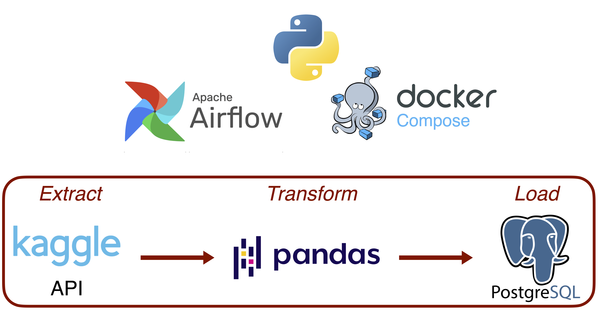
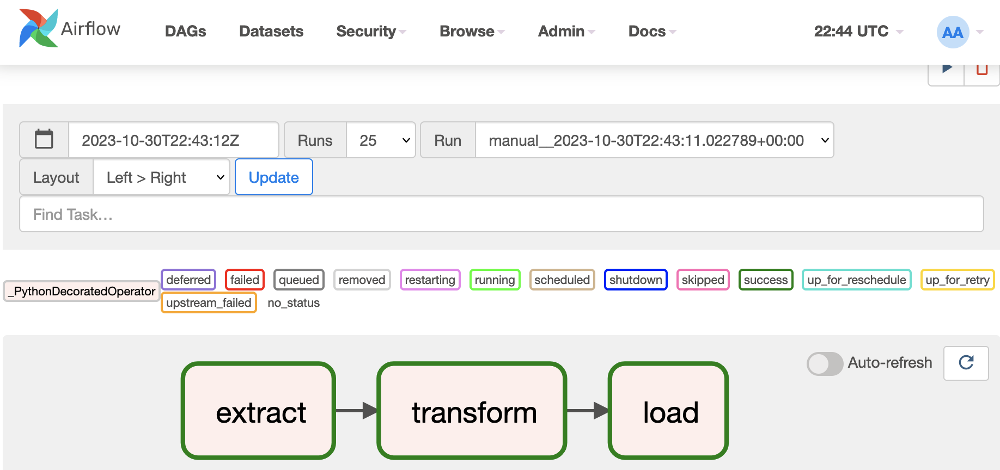

# ETL Pipeline on Remarkable Trees data

This projects presents a simple ETL (Extract, Transform and Load) pipeline in which:
- data are extracted from a dataset using the Kaggle API
- data are transformed using the Pandas library
- data are loaded in a PostgreSQL database

Python is mainly used within this project. Apache Airflow is considered for creating the pipeline. The orchestration is done with Docker compose. 

**Dataset**

<u>URL:</u> https://www.kaggle.com/datasets/mpwolke/cusersmarildownloadstreescsv

Dataset concerns a description and location of remarkable trees at Paris, published by *Direction des Espaces Verts et de l'Environnement - Ville de Paris*.

**How to use it**
1. For enabling Kaggle API use, credentials defined by Kaggle's username and API key need to be set. For that purpose, copy your <code>kaggle.json</code> file into the <code>config</code> directory. \
<u>Command</u>: <code>cp ~/.kaggle/kaggle.json config/</code>

2. Run the database migration and create the first user <code>admin</code> with the related password <code>1234</code>. \
<u>Command</u>: <code>docker-compose up 
airflow-init</code>

3. Then, run all services. \
<u>Command</u>: <code>docker-compose up</code>

4. Finaly, load the Airflow GUI to play with the pipeline by going to <code>http://0.0.0.0:8080</code>. Unpause DAGs and trigger them.

**Tools**
- Python
- PostgreSQL
- Apache Airflow
- Docker
